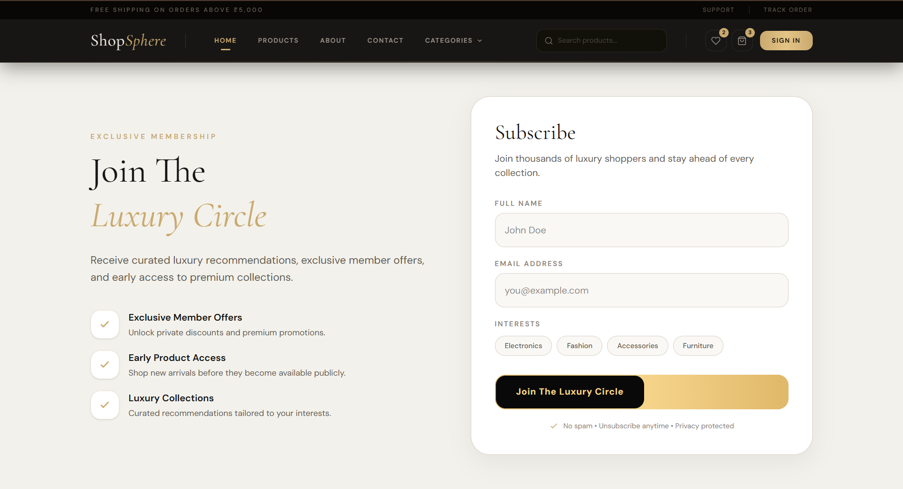
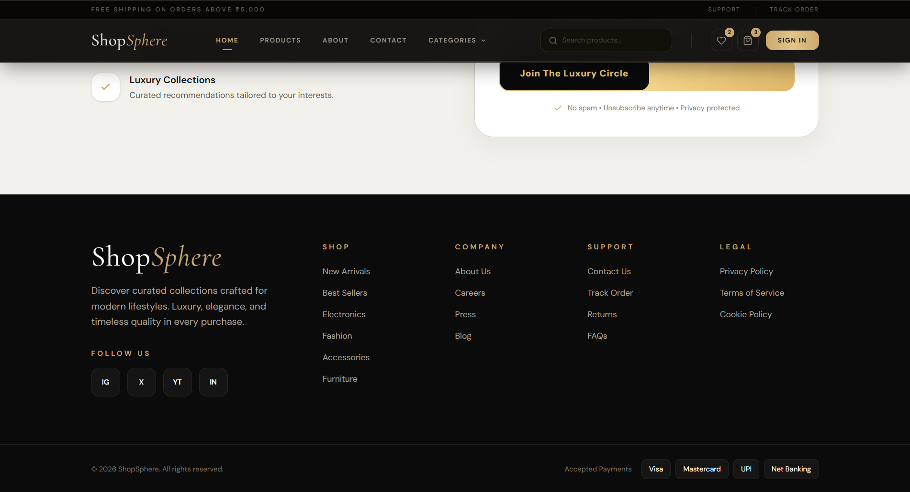
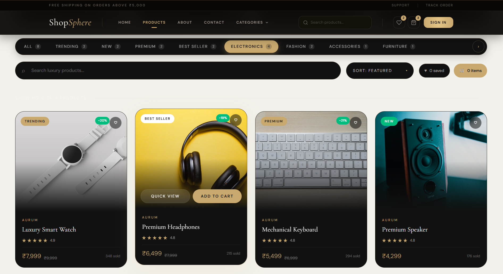
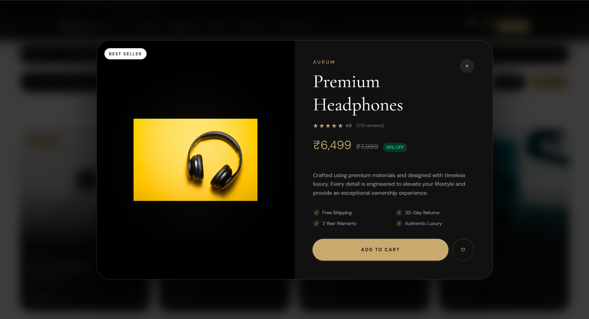
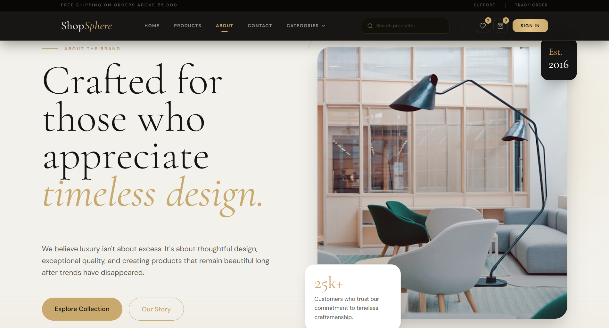
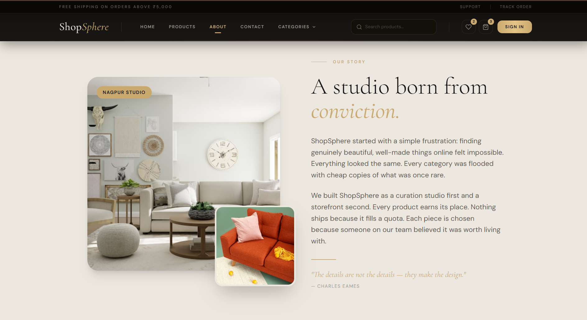
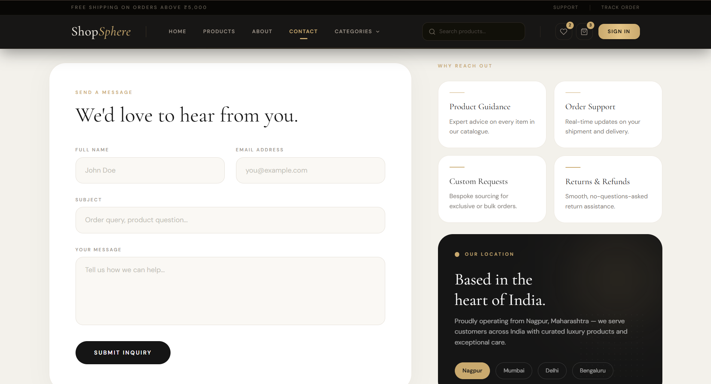

# ShopSphere — Luxury E-Commerce Frontend

ShopSphere is a modern luxury-inspired e-commerce frontend built with React, Vite, and Tailwind CSS. The project delivers a premium shopping experience through elegant UI design, responsive layouts, smooth animations, and a carefully crafted warm-gold visual identity.

The application features a curated product catalog with category-based browsing, interactive product showcases, a fully designed About page, a responsive Contact page with FAQs and inquiry forms, and a polished navigation system optimized for desktop and mobile devices. Every section follows a consistent design language using sophisticated typography, refined spacing, and immersive visual effects to create a high-end brand experience.

---

## ✨ Key Features

* Modern React + Vite architecture
* Fully responsive design across devices
* Luxury-themed UI with warm gold aesthetics
* Interactive product catalog and filtering
* Featured categories section
* Dedicated About and Contact pages
* FAQ and customer inquiry form
* Smooth animations and transitions
* Reusable component-based structure
* Tailwind CSS for scalable styling
* React Router DOM for seamless navigation

---

## 🛠 Tech Stack

* React
* Vite
* Tailwind CSS
* React Router DOM
* Framer Motion
* Lucide React
* Styled Components

---

# 🏠 Home Page

## Hero Section


## Featured Categories


## Product Showcase


## Newsletter Section



## Footer



---

# 🛍 Products Page

## Product Grid





---

# ℹ️ About Page






---

# 📞 Contact Page





---

## 🚀 Getting Started

### Clone the Repository

```bash
git clone <your-repository-url>
```

### Navigate to Project Folder

```bash
cd Assignment1
```

### Install Dependencies

```bash
npm install
```

### Start Development Server

```bash
npm run dev
```

### Build for Production

```bash
npm run build
```

---

## 📱 Responsive Design

ShopSphere is fully optimized for:

* Desktop
* Laptop
* Tablet
* Mobile Devices

---

## 🎨 Design Philosophy

The visual identity of ShopSphere is inspired by luxury fashion and premium lifestyle brands. The interface combines elegant typography, refined spacing, warm gold accents, premium dark sections, smooth transitions, and modern animations to create a sophisticated shopping experience.

---

## 📂 Project Structure

```text
src/
├── assets/
├── Components/
│   ├── Products/
│   ├── Screenshots/
│   ├── Navbar.jsx
│   ├── HeroSection.jsx
│   ├── FeaturedCategories.jsx
│   ├── ProductCards.jsx
│   ├── Newsletter.jsx
│   └── Footer.jsx
├── pages/
├── App.jsx
├── main.jsx
└── index.css
```

---

## 📄 License

This project is created for learning, portfolio, and frontend development practice purposes.

---

### Author

Developed as a luxury e-commerce frontend project using React, Vite, Tailwind CSS, and modern UI/UX principles.
