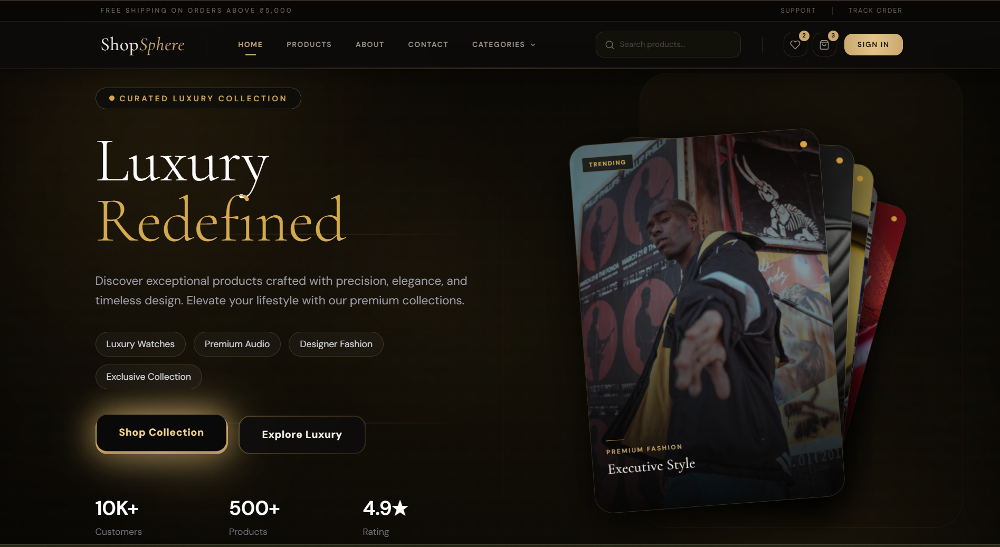
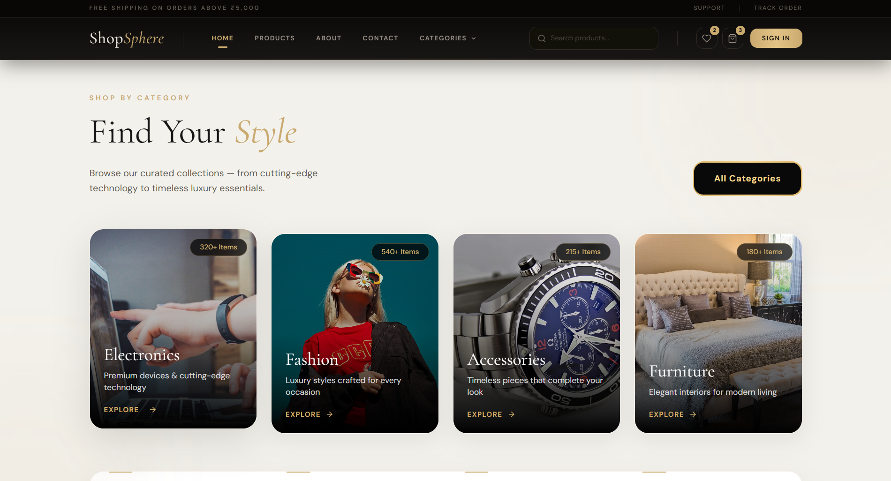
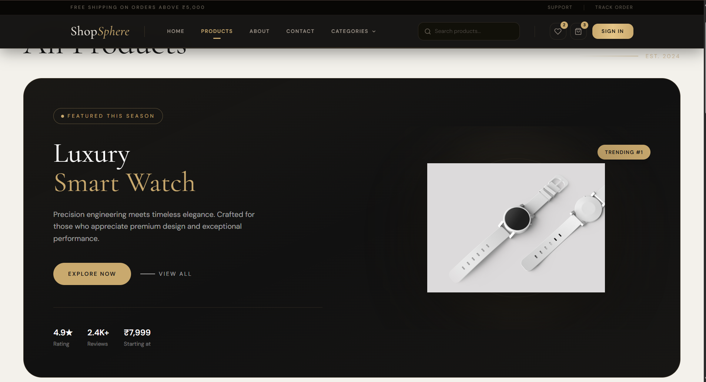
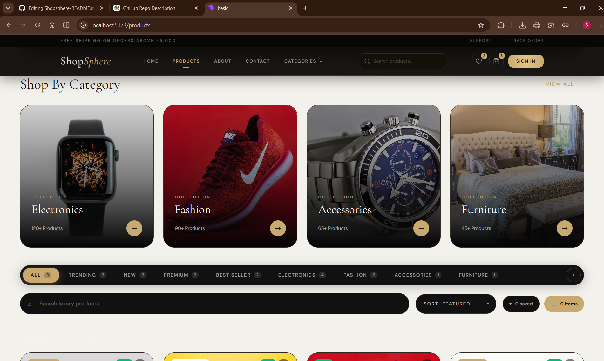
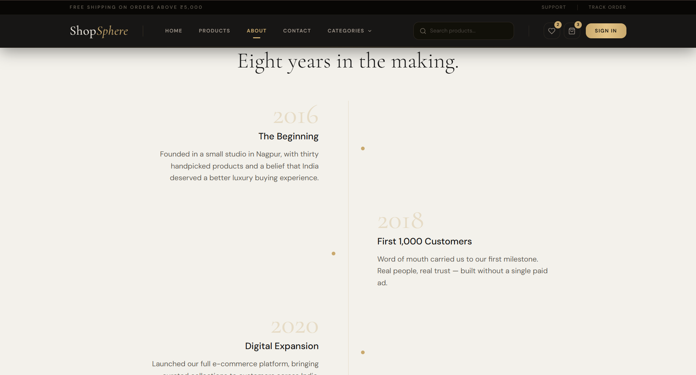
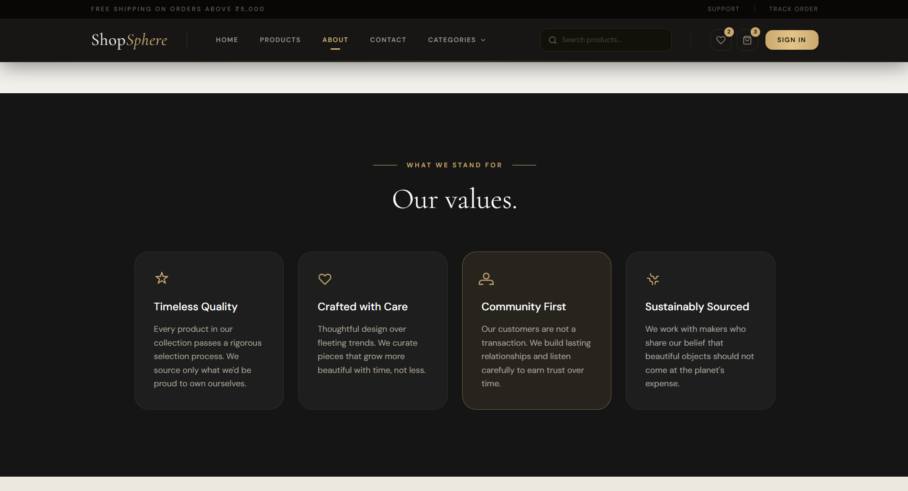
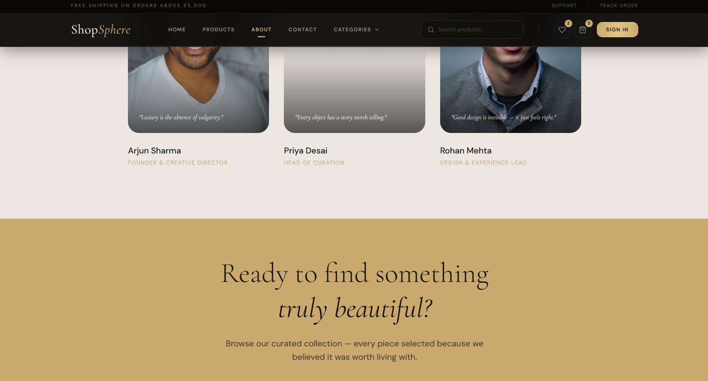
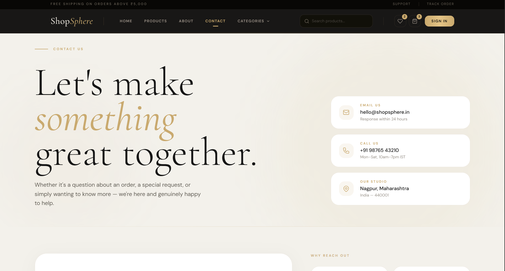
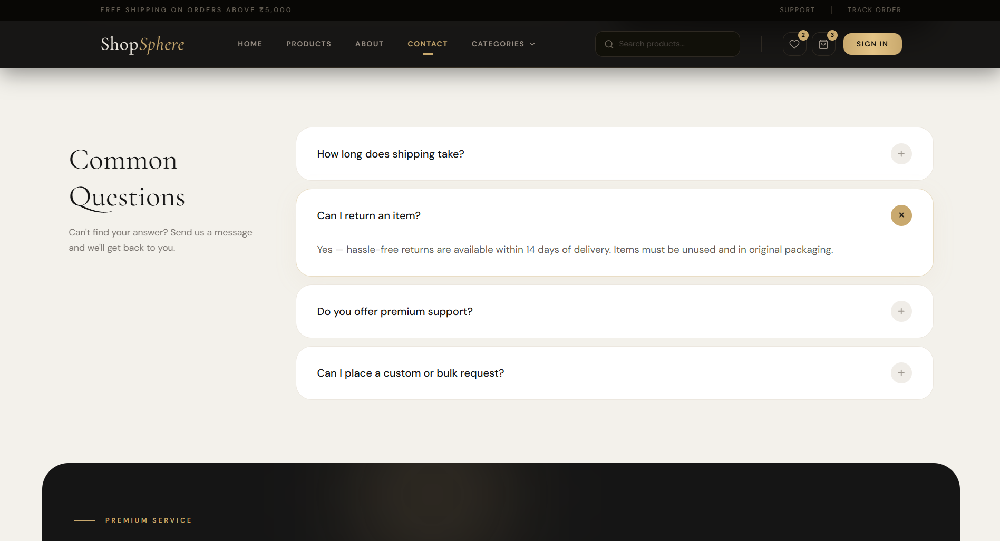
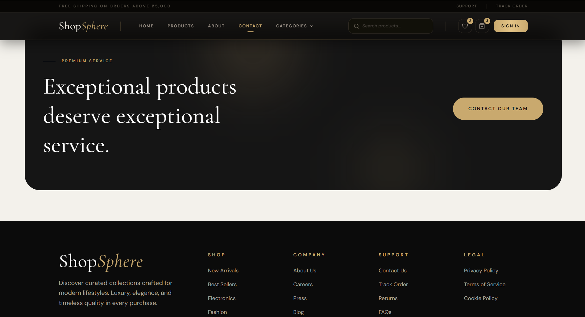

# ShopSphere — Luxury E-Commerce Frontend

ShopSphere is a modern luxury-inspired e-commerce frontend built with React, Vite, and Tailwind CSS. The project delivers a premium shopping experience through elegant UI design, responsive layouts, smooth animations, and a carefully crafted warm-gold visual identity.

The application features a curated product catalog with category-based browsing, interactive product showcases, a fully designed About page, a responsive Contact page with FAQs and inquiry forms, and a polished navigation system optimized for desktop and mobile devices. Every section follows a consistent design language using sophisticated typography, refined spacing, and immersive visual effects to create a high-end brand experience.

---

## Home Page

### Hero Section

### Featured Categories

### Product Showcase

---

## Products Page

### Product Grid

---

## About Page

---

## Contact Page

---

## Key Features

- Modern React + Vite architecture
- Fully responsive design across devices
- Luxury-themed UI with warm gold aesthetics
- Interactive product catalog and filtering
- Featured categories section
- Dedicated About and Contact pages
- FAQ and customer inquiry form
- Smooth animations and transitions
- Reusable component-based structure
- Tailwind CSS for scalable styling
- React Router for seamless navigation

---

## Tech Stack

- React
- Vite
- Tailwind CSS
- React Router DOM
- Motion
- Lucide React
- Styled Components

---

ShopSphere demonstrates modern frontend development practices while focusing on premium branding, usability, and responsive user experience for luxury e-commerce platforms.
